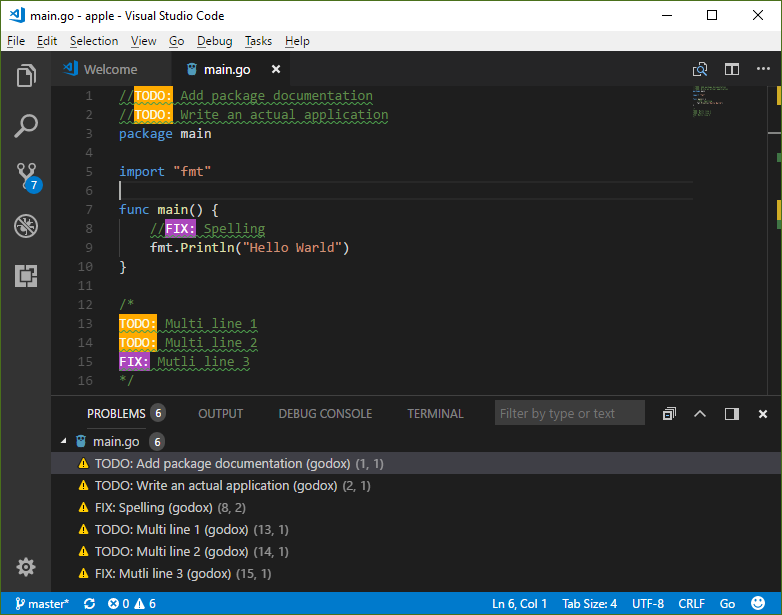

GoDoX
===
GoDoX extracts comments from Go code based on keywords

Installation
---

    go get -u github.com/766b/godox

Usage
---
Any comment lines starting with `TODO` or `FIX` (or other specified keywords, case insensitive) are extracted. If `TODO`/`FIX` comments is longer that 1 line, then only first line will be extracted.

    $ godox [<flags>] [<path>...]

    $ godox -help
        -keys string
            Change keywords (default "todo,bug,fix")

    $ godox ./path/to/directory ./path/to/secondary/directory
    example.go:3:1:TODO: Implement io.Writer interface
    example.go:7:14:TODO: Rename field
    example.go:10:1:TODO: Add JWT verification
    example.go:15:3:FIX: Something that is broken

Usage with Go Meta Linter
---

    gometalinter --linter=godox:godox -keys=todo,fix:PATH:LINE:COL:MESSAGE --enable=godox [<flags>] [<path>...]

Usage with Visual Studio Code
---
To use `GoDoX` with `VS Code` you need to have [Go Meta Linter](https://github.com/alecthomas/gometalinter) installed, then add following to your `User Settings (Ctrl+,)`

    "go.lintTool": "gometalinter",
    "go.lintFlags": [
      "--disable-all", // Disable all linters
      "--linter=godox:godox:PATH:LINE:COL:MESSAGE"
      "--enable=godox",
      "--enable=golint", // Enable any other linters you want to use
    ],

If you want to use custom keywords, use following line:

    "--linter=`godox:godox -keys=bug,todo,fixme:PATH:LINE:COL:MESSAGE`",